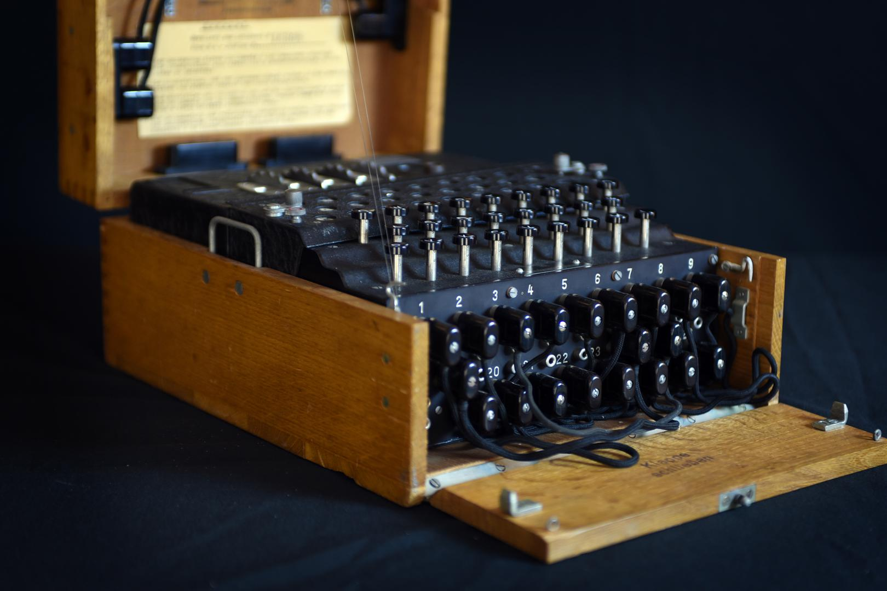

# Enigma Machine

## History/Background
The Enigma machine is an encryption device developed and used in the early- to mid-20th century to protect commercial, diplomatic and military communication. It was employed extensively by Nazi Germany during World War II, in all branches of the German military.
The Enigma machines were a family of portable cipher machines with rotor scramblers. It was broken by the Polish General Staff's Cipher Bureau in December 1932, with the aid of French-supplied intelligence material obtained from a German spy.

## enigma.py
The program is imitation of the enigma machine written in python.

## bombe.py
Bruteforce tool for enigma machine. Uses specified key words to be detected when going through the permutations.
